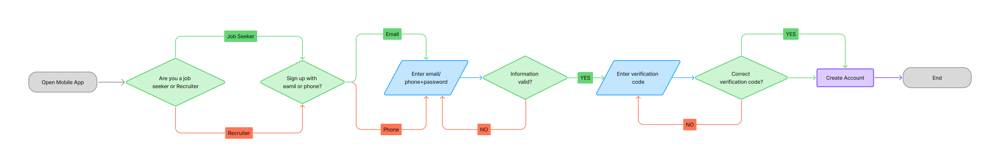
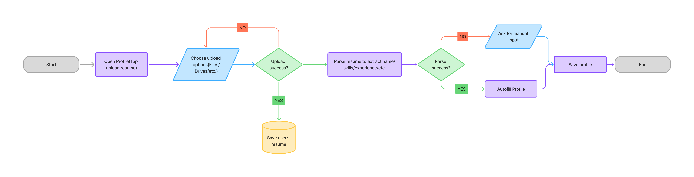
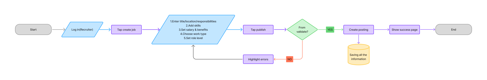

# Specification Phase Exercise

A dating app for corporate recruiting. Our app is called “OKSalary”, similar to the dating app “OKCupid”. 

Key Stakeholders: 
1. Hiring Managers in a company who post roles. 
2. Job seekers who try to match with job roles. 

Job seekers see a variety of different open job roles, which they can click “interested” in (similar to swiping right). 

How the app operates: Similar to dating apps where two profiles are matched if both people swipe right, for our app job seeker profiles are considered a “user” and the job role profile is considered a “user”. Profiles from job seekers can include their resume, a portfolio of images/videos of their accomplishments, and a short “about me” section about their skills and interests. Job role profiles can include any specifications about the job, and photos of the office/videos. 

When both the hiring manager who is within the specific role profile swipes right and the user swipes right, both are matched into a chat section. From there, they can have a more informal “coffee chat” to get to know each other, and if that goes well the pair can take it from there. 

## Team members

Peter Jinyuan Ma: https://github.com/pjm9792-ui

Zelu Zhang: https://github.com/zzl0720-2025

Jerry Wang : https://github.com/JerrrryWang

## Stakeholders

Interviewee 1: Saami (Finance student at NYU recruiting for sales and trading) 

Goals: 
1. Get matched to roles that actually fit his profile. He wants the app to narrow opportunities to positions that align with his year, target functions (sales & trading), skills, and eligibility constraints. Instead of browsing hundreds of generic finance listings, he needs a feed that feels pre-qualified so each swipe is worth attention.

2. Move from discovery to a real human conversation quickly. His priority is shortening the time between “I’m interested” and “someone at the firm actually sees me.” A match-based system should feel like a clear step forward, not another application submitted into a void. He wants a path to an actual chat without sending dozens of cold messages.

3. Show personality and capability beyond a resume. He wants to present signal that resumes do not capture well, like how he communicates, what he is genuinely interested in, and what he has built or accomplished. Short portfolio items (trade writeups, competition results, personal projects, or a quick intro video) help him feel like he can differentiate, especially when many applicants have similar coursework.

4. Make networking efficient and outcome-oriented. He still expects to “network,” but he wants it to be less random and more tied to roles that are actively hiring. Ideally coffee chats happen only after mutual interest is established so the conversation feels purposeful and has a clear next step instead of being purely social.

Frustrations: 
1. Networking feels performative and repetitive. He finds coffee chats draining because they often turn into scripted conversations where he asks the same questions and flatters the same talking points. The effort does not reliably translate into interviews, which makes the whole process feel inefficient and psychologically exhausting.

2. Low transparency about what jobs are really like. Many postings do not tell him the true day-to-day tasks, training quality, team culture, hours, or what makes a candidate succeed. He ends up spending time applying or networking before he even knows if the role is something he would want or be good at, which creates wasted effort and mismatched expectations.

3. High ghosting risk and weak feedback loops. After reaching out, applying, or even chatting, he often gets no response and no closure. Without feedback, he cannot improve his approach, and the uncertainty makes it hard to plan his time. The emotional cost is high because every outreach attempt feels like it might disappear with no explanation.

4. Hard to signal genuine interest without spamming. He wants a way to show “I really want this specific role” without applying to everything or sending aggressive follow-ups. When the only lever is volume, candidates either become spammy or invisible. A stronger interest signal would let him be selective while still being noticed.

Interviewee 2: Felix (Product manager at Bytedance in China who worked as interviewer and hiring manager)
Felix is a hiring manager in China. 

Goals/Needs:
1. Find high-signal candidates without wading through noise. He needs a system that filters down to people who are plausibly qualified and relevant, because his time is limited and screening is expensive. The ideal outcome is that most profiles he sees are at least worth a short interaction, rather than being obviously mismatched.

2. Evaluate fit earlier than the formal interview stage. He wants to see evidence of thinking, communication, and execution before investing in multiple interview rounds. A richer profile helps him judge whether a candidate can actually do the work and collaborate well, not just list impressive names or titles.

3. Increase speed of initial outreach and reduce drop-off. Hiring pipelines lose good candidates when timelines are slow or communication is unclear. He wants a faster way to initiate contact with strong candidates, keep them engaged, and move them to the next step before competing offers appear.

4. Ensure mutual intent before spending effort. He does not want to schedule calls with candidates who are only vaguely interested or are applying everywhere. Mutual swiping creates a clearer signal that the candidate is open to the role and the specific team, which makes his effort more likely to convert into hires.

Frustrations: 
1. Resumes often misrepresent real ability. He frequently sees inflated claims, keyword-stuffed descriptions, and titles that do not map cleanly to actual skill. This makes resume screening unreliable and forces him to spend extra time validating basics that should have been clear from the start.

2. Applicant volume makes careful review impossible. When many people apply, even good teams end up doing shallow scans and missing promising candidates. The funnel becomes inefficient because the process optimizes for speed over accuracy, which leads to both false positives (wasted interviews) and false negatives (missed talent).

3. Early-stage signal is too low to make confident choices. At the start, he wants to answer: “Can this person think well and execute?” but the materials provided usually do not show it. Without work samples or clear evidence, he must rely on weak proxies like school name or past company, which is not ideal.

4. Coordination overhead is a major hidden cost. Even once he identifies good candidates, scheduling interviews, aligning multiple interviewers, and maintaining communication is tedious. The friction slows the process and increases the chance that candidates lose interest, especially when competing employers move faster.

## Product Vision Statement

A swipe-based job matching app that helps job seekers quickly discover and connect with relevant opportunities while enabling recruiters to efficiently identify, engage, and hire candidates through fast, transparent, and mutually interested matches.

## User Requirements

### User tpye1: Job Seeker(Candidate)

1. As a job seeker, I want to create an account with email or phone so that I can start applying quickly.
2. As a job seeker, I want to build a profile with my role, skills, and experience so that recruiters understand my background.
3. As a job seeker, I want to upload my resume so that I can share details without retyping everything.
4. As a job seeker, I want to set the roles I’m looking for so that I only see relevant jobs.
5. As a job seeker, I want to set my preferred locations and remote options so that matches fit my constraints.
6. As a job seeker, I want to set a salary range so that I don’t waste time on mismatched expectations.
7. As a job seeker, I want to choose work type (internship/full-time/contract) so that job suggestions align with my goals.
8. As a job seeker, I want to set industry preferences so that I can focus on companies I care about.
9. As a job seeker, I want to filter jobs by seniority level so that I don’t see roles that are too junior or too senior.
10. As a job seeker, I want to view a job’s key details (company, responsibilities, requirements) so that I can decide confidently.
11. As a job seeker, I want to message a recruiter after matching so that I can ask questions and clarify next steps.
12. As a job seeker, I want to share my resume or portfolio link in chat so that I can provide evidence of my work.
13. As a job seeker, I want to receive notifications for new matches and messages so that I don’t miss opportunities.

### User type2: Recruiter

1. As a recruiter, I want to create a recruiter account so that I can post roles and find candidates.
2. As a recruiter, I want to verify my company affiliation so that candidates trust that I’m legitimate.
3. As a recruiter, I want to create a job posting with title, location, and responsibilities so that candidates understand the role.
4. As a recruiter, I want to list required skills and nice-to-have skills so that matching is accurate.
5. As a recruiter, I want to set compensation range and benefits so that expectations are clear early.
6. As a recruiter, I want to specify work type (remote/hybrid/on-site) so that candidates self-select correctly.
7. As a recruiter, I want to set hiring urgency and start date so that candidates know the timeline.
8. As a recruiter, I want to target a role level (intern/new grad/mid/senior) so that I see appropriate profiles.
9. As a recruiter, I want to browse candidate cards quickly so that I can source efficiently.
10. As a recruiter, I want to swipe right on candidates I’m interested in so that I can express intent fast.
11. As a recruiter, I want to pause or close a job posting so that I stop receiving new matches when the role is filled.

## Activity Diagrams

Diagram1 : Create Account

Diagram2 : Job Seekers-Upload Resume

Diagram3 : Recruiter-Create Jobs

Diagram4 : Recruiter-Brose & Swipe

## Clickable Prototype

https://www.figma.com/proto/TftWFGNk0fQCLWdEF986z2/Loris-OKsalary?node-id=1-2&t=jzjtq1QAYcX9Q3zj-1
